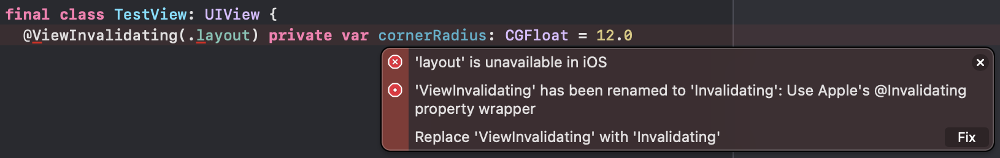
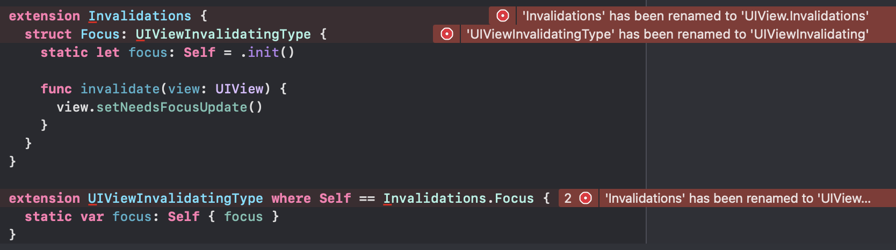
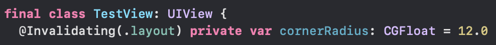
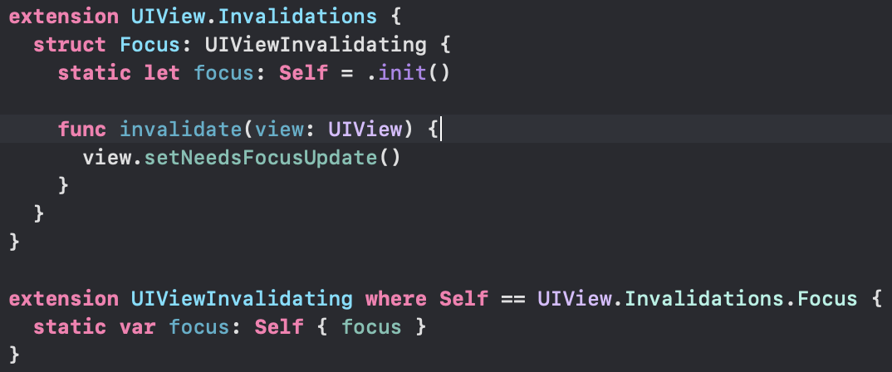

# ViewInvalidating

A property wrapper that backports the new `@Invalidating` property wrapper to older versions of iOS/tvOS/macOS. For more information on this new property wrapper, see the WWDC 2021 talk ["What's new in AppKit"](https://developer.apple.com/wwdc21/10054) for a brief introduction.

The syntax and types closely follows what Apple is doing, so when it's time to finally update your project's deployment target to iOS 15+/tvOS 15+/macOS 12+, you can easily migrate to using Apple's version by making very minimal changes. See the [migration section](#migration-to-ios-15+/tvos-15+/macos-12+-deployment-target) for more info!

## Usage

Annotate your `Equatable` properties with `@ViewInvalidating` and provide options that will be used to invalidate the view whenever the property's value changes:

```swift
final class MyView: UIView {
  // Calls setNeedsLayout()
  @ViewInvalidating(.layout) var cornerRadius: CGFloat = 12.0
  
  // Calls setNeedsLayout() then setNeedsUpdateConstraints()
  @ViewInvalidating(.layout, .constraints) var heightConstraintValue: CFloat = 200.0
  
  // Calls setNeedsLayout() then setNeedsUpdateConstraints() then invalidateIntrinsicContentSize()
  @ViewInvalidating(.layout, .constraints, .intrinsicContentSize) var magicProperty: CGFloat = 1234.0
```

You can initialize the property wrapper with up to 10 options. You can of course add extensions to support more options though, but realistically speaking you'll likely never have a need to pass more than a few of them!

By default, there is support for a total of 5 invalidation options per platform:

#### Common
- Layout
- Display
- Constraints
- Intrinsic Size

#### macOS only
- Restorable State

#### iOS 14+ only
- Configuration

### Adding custom invalidators

You can add custom invalidators by creating a type that conforms to `UIViewInvalidatingType` or `NSViewInvalidatingType` protocol (depending on the target platform) and implementing the `invalidate` method requirement:

```swift
extension Invalidations {
  struct Focus: UIViewInvalidatingType {
    static let focus: Self = .init()

    func invalidate(view: UIView) {
      view.setNeedsFocusUpdate()
    }
  }
}
```

You can then expose it to the property wrapper by extending the `InvalidatingStaticMember` type:

```swift
extension InvalidatingStaticMember where Base: UIViewInvalidatingType {
  static var focus: InvalidatingStaticMember<Invalidations.Focus> { .init(.focus) }
}
```

> #### Note: 
>
> If you're using Xcode 13, you should do this instead:
>
> ```swift
> extension UIViewInvalidatingType where Self == Invalidations.Focus {
>  static var focus: Self { .focus }
> }
> ```

> The `InvalidatingStaticMember` type only exists to workaround some language limitations which have been addressed in Swift 5.5, which ships with Xcode 13. So if you're on the latest Xcode, you do not need to use the workaround. The `InvalidatingStaticMember` will also be unavailable.

Then you can use your new invalidator on `@ViewInvalidating`:

```swift
final class MyView: UIView {

  // Calls setNeedsLayout() and Focus.invalidate(self)
  @ViewInvalidating(.layout, .focus) var customProperty: CGFloat = 1.0
}
```

## Requirements

- Deployment target of iOS 11+, tvOS 11+ or macOS 10.11+
- Xcode 11 or above

## Installation

Add the following to your project's `Package.swift` file:

```swift
.package(url: "https://github.com/theblixguy/Invalidating", from: "0.1.0")
```

or add this package via the Xcode UI by going to File > Swift Packages > Add Package Dependency.

## Migration to iOS 15+/tvOS 15+/macOS 12+ deployment target

When it's time to update your project's deployment target to iOS 15+/tvOS 15+/macOS 12+, you will need to make some very minor changes to your code to make it compatible with Apple's `@Invalidating` and related types.

The types that ship with this package have been annotated with `@available` and contain the right mappings to Apple's types on its `renamed` argument to make it super easy for you to update your code. Once you have update the deployment target, you will see some errors:




As you can see, they all offer a fix-it to automatically change the type names. With a click of a button, the errors disappears without you even having to manually rename them:




✨

## License

```
MIT License

Copyright (c) 2021 Suyash Srijan

Permission is hereby granted, free of charge, to any person obtaining a copy
of this software and associated documentation files (the "Software"), to deal
in the Software without restriction, including without limitation the rights
to use, copy, modify, merge, publish, distribute, sublicense, and/or sell
copies of the Software, and to permit persons to whom the Software is
furnished to do so, subject to the following conditions:

The above copyright notice and this permission notice shall be included in all
copies or substantial portions of the Software.

THE SOFTWARE IS PROVIDED "AS IS", WITHOUT WARRANTY OF ANY KIND, EXPRESS OR
IMPLIED, INCLUDING BUT NOT LIMITED TO THE WARRANTIES OF MERCHANTABILITY,
FITNESS FOR A PARTICULAR PURPOSE AND NONINFRINGEMENT. IN NO EVENT SHALL THE
AUTHORS OR COPYRIGHT HOLDERS BE LIABLE FOR ANY CLAIM, DAMAGES OR OTHER
LIABILITY, WHETHER IN AN ACTION OF CONTRACT, TORT OR OTHERWISE, ARISING FROM,
OUT OF OR IN CONNECTION WITH THE SOFTWARE OR THE USE OR OTHER DEALINGS IN THE
SOFTWARE.
```
